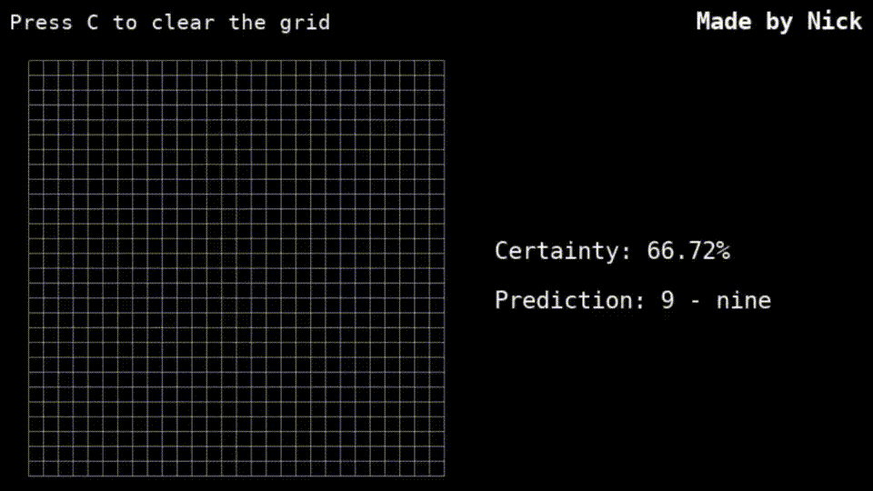
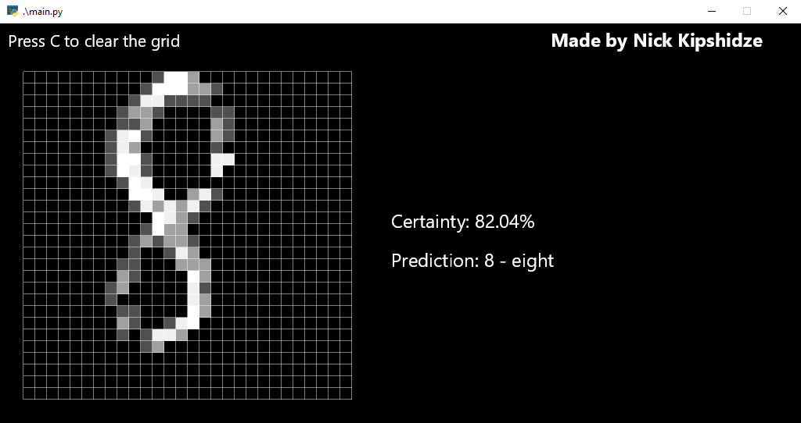
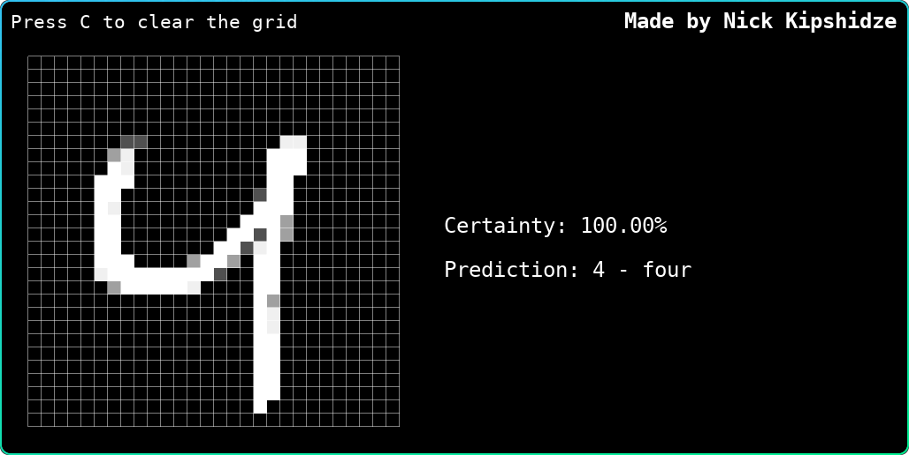

# Handwritten digits recognition

Interactive handwritten digits live recognizer with Pyglet and PyTorch.



Here's a preview of the program in action. Cool right? It thinks that a smiley face is 2. The drawing functionality came out pretty good, I didn't inted it to be that smooth, but the way I made it resulted in it accidentally looking exactly like MNIST digits. I didn't directly implement anti-aliasing or anything.

## Cross platform

It works on most of the platforms. On Windows you may need to jump through some hoops, download [some stuff](https://www.microsoft.com/en-US/download/details.aspx?id=48145&lt). Windows is weird, but it works.



It was made in and for Linux, so it will work on Linux the best.



## Running the code

Here's the whole command sequence for running the code, I won't bother you with line by line guides and explanations:

```shell
git clone https://github.com/nickkipshidze/handwritten-digits-reco/
cd handwritten-digits-reco
pip3 install torch torchvision --index-url https://download.pytorch.org/whl/cpu
pip3 install -r requirements.txt
python3 main.py
```

You can just copy and paste that in the terminal and it should work. You are installing *PyTorch* and *torchvision* separately because it needs to be specified that you want the CPU version, which is more easy to set up and work with. I have a laptop so no CUDA for me.

## Other stuff

I wrote the project in 3 hours, I was bored. Although I keep adding features, because it's fun. The base project including the model and the user interface took 3 hours. No copypasta here, it's just me and my code. I also learned Pyglet in 1 hour too so, contribute to my bad code.

So... if you like this project, [reach out](mailto:kipshidze.nick@gmail.com). Let's do something together. I like AI and stuff. I can also build web servers and frontends.
